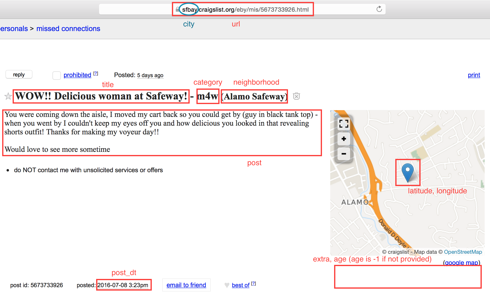

# Craigslist Missed Connections

### Contents
**NLP_scripts**<br>
Contains files for content analysis of Missed Connections (see its [README](https://github.com/stong1108/CL_missedconn/tree/master/NLP_scripts) for more info).

**webapp**<br>
Contains files for the Missed Connections Explorer web app.

**saved_maps**<br>
Contains html files for interactive maps.

**MissedConn.py**<br>
Class file for a Missed Connections scraper object.

A MissedConn object scrapes Craigslist Missed Connections for a given city. Initialize an object with the url of a city's Craigslist Missed Connections page.

Attributes:
+ `starturl`: url of a Craigslist Missed Connections page used to initialize MissedConn object (e.g. "https://sfbay.craigslist.org/search/mis")
+ `city`: city of the Missed Connections object (e.g. "sfbay")
+ `record_dt`: datetime of when the post was scraped
+ `df`: DataFrame that is populated in the scraping process

Methods:
+ `get_df(update=False)`: Populates and returns self.df with Missed Connection post info. If update is True, the object will only scrape the city's Missed Connections up until the last recorded datetime stored in the PostgreSQL database.

Example:
```
mc = MissedConn('https://sfbay.craigslist.org/search/mis')
df = mc.get_df()
```
*after some time passes, update*
```
df2 = mc.get_df(update=True)
```
***
**manage_db.py**<br>
Contains functions for creating, updating, and retrieving Missed Connections info.

`create_db()`
<br>Creates the database `cl_missedconn`.

`create_table(df)`
<br>Creates the table `missedconn`.

`most_recent_post_dt(city)`
<br>Retrieves the datetime of the most recent post stored in `missedconn` for a given city.

`update_db(df)`
<br>Updates the `missedconn` table with the information in a DataFrame. Only posts that have a unique url are added (no reposts or updated posts).

`db_to_df()`
<br>Creates and outputs a DataFrame representation of `missedconn`.

`make_english_pickle(picklename)`
<br>Creates a pickle object containing English posts only.

***
**maps.py**<br>
Contains functions for creating Folium maps to visualize Missed Connections postings. Jupyter notebooks are handy for quick map rendering.

*Note: currently, these maps only display posts where latitude/longitude data were provided*

`make_pinned_map(df, links=False, zoom=12)`
<br>Creates and returns a Folium Map object with popup pins for each post.

`make_heat_map(df, zoom=9)`
<br>Creates and returns a Folium Map object representing a heat map of posts.
***
Scraped fields include:

|Field|Data Type|Description|
|---|---|:--|
|`url`|str|page url of Missed Connection post|
|`title`|str|title of Missed Connection post|
|`category`|str|string describing gender posting Missed Connection for ("4") another gender- m4w, m4m, w4m, w4w, or None|
|`post_dt`|datetime|timestamp of when post was created (or updated)|
|`latitude`|float|latitude of pin provided in Missed Connection's map if a map was included (None if no map was included)|
|`longitude`|float|longitude of pin provided in Missed Connection's map if a map was included (None if no map was included)|
|`neighborhood`|str|neighborhood (or other description) of where Missed Connection occurred|
|`extra`|str|extra self-description fields provided by the Missed Connection author (age, body type, height, eye color, hair color, etc.)|
|`age`|int|age provided by Missed Connection author (-1 if no age provided)|
|`post`|str|content of Missed Connection post that describes the interaction|
|`record_dt`|datetime|timestamp of when Missed Connection post was scraped|
|`city`|str|city that Missed Connection was posted under|
|`raw_page`|str|string of raw html of Missed Connection (unaltered data)|
|`has_pic`|int|1 if Missed Connection contained a picture, 0 if no picture|
***
Example:


